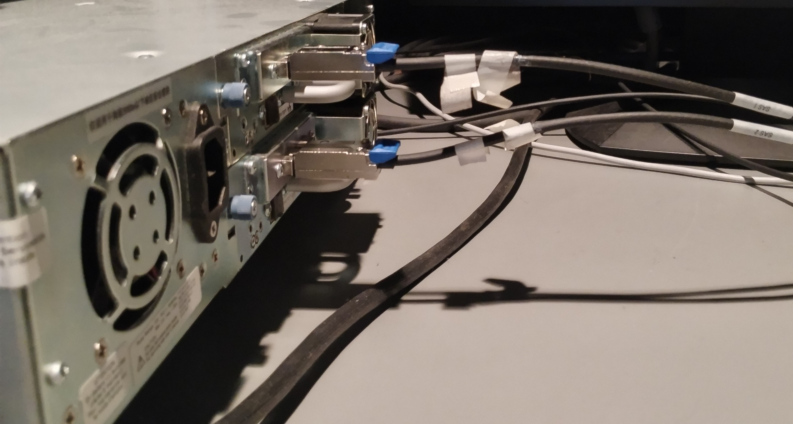
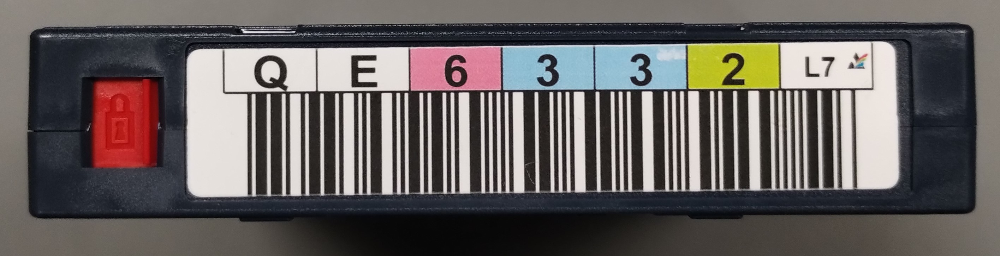

# LTO Documentation - Command Line

## Terms and Definitions

### Device Numbering

- Connected devices such as LTO drives, CD drives, etc. are loaded via the Linux "SCSI generic" (sg) driver.
- Tape drives specifically will be loaded using the "SCSI tape" (st) driver as well.
- Connected devices of each type will receive a corresponding number (i.e. sg3, st0) starting at 0 and are accessible in the directory **/dev**.
- To keep this documentation generic the **#** sign is used in place of numbers in most places.
- For example, `/dev/sg5` or `/dev/st0` will instead be referred to as `/dev/sg#` and `/dev/st#` as the number may vary depending on your configuration.

### **/dev/st0** vs **/dev/nst0**

- Both of these can be used to refer to the first tape device connected to your computer.
- However, there is a difference in the tape device functionality denoted by each.
- `/dev/st#` is a rewinding device.
- `/dev/nst#` is a non-rewinding device.
- If you want the tape to rewind after an action is performed, it should be referenced as `/dev/st#`
- If you want to leave off at the end of your last action on the tape (for example when writing files to prevent overwriting data), you would use `/dev/nst#`
- As long as you remember to manually rewind or seek to the correct location when necessary, `/dev/nst#` should always work. `/dev/nst#` is the safer option, especially when working with multiple tapes mounted simultaneously. For example, if a user enters the `st` command with the wrong device number a tape could get rewound during a read/write operation. 
- Use the following command to rewind.
  ```
  sudo mt -f /dev/st# rewind
  ```
### **/dev/sg#** vs **/dev/sch#**

- The tape library commands using `mtx` can use either the SGSI generic number (/dev/sg#) or the SCSI Changer number (/dev/sch#).
- `/dev/sch#` will generally be easier to identify since there is likely to only be one changer connected to the computer at a time.

## Installation - Prerequisites

Currently this documentation only covers use on Linux operating systems.

### Linux

Depending on your specific needs, you must first install some or all of the following:
- `mt-st` - for tape control
- `mtx` - for auto-loaders and tape libraries
- `lsscsi` - for getting info about SCSI devices
- `ltfs` - Linear Tape File System. Install the reference implementation from [here](https://github.com/LinearTapeFileSystem/ltfs "ltfs reference implementation")
- `bru` - Download and install Argest BRU Core from the [BRU website](https://www.tolisgroup.com/index.html "BRU website")

### Permissions

- By default, only the Super User will have permission to use tape devices and tape-related commands
- To give a standard user access to tape devices:
  - Run `sudo usermod -a -G tape username` where `username` is the name of the user that you want to grant access to tape devices
  - Restart your computer
  - If the command was successful, you should now see `tape` listed as one of the groups when running the `groups` command as that user
  - You can also check the `/etc/group` file and make sure that that user is listed next to the `tape` group

## Connecting Everything

- Connect and turn on your LTO drive

  
  *LTO drives*

  
  *SAS cable*

  
  *SAS cables connected to LTO drives*

- To check that the drive is correctly recognized, run the command:
  ```
  cat /proc/scsi/scsi
  ```
- If you are using an auto-loader, you should see two tape-related devices (in this case associated with scsi6, but with different Lun numbers)

  
  *Auto-loader tape library*

### Checking SCSI Devices Using lsscsi

- The `lsscsi` command can also be used to get information about connected SCSI devices, including the sg/sch/st numbers needed to reference each.
- To check all SCSI devices, use the `lsscsi -l` command.
- To check for tape devices, run the command:
  ```
  lsscsi -l | grep tape
  ```
- To check for tape libraries, run the command:
  ```
  lsscsi -l | grep medium
  ```

## Loading Tapes From a Tape Library

- Start by checking the status of the tape library. This will let you know which tapes are loaded into which slots.
  ```
  sudo mtx -f /dev/sch# status
  ```
- Next, load the tape from the desired slot into the desired drive.
- `mtx` load commands use the following structure:
  ```
  sudo mtx -f /dev/sch# load slot# drive#
  ```
- If loading a tape into device 0 (the first device recognized), `device#` can be either `0` or omitted from the command.
- In this example command, we are loading a tape from slot 6 into device 0
  ```
  sudo mtx -f /dev/sch5 load 6
  ```
- Once the tape loads, you can verify that the tape has loaded correctly using the following command:
  ```
  sudo mt -f /dev/nst# status
  ```
- Near the top of the returned text you should see information about where in the tape you currently are.
- `File number=0, block number=0, partition=0` means that you are at the beginning of the tape. You will also get a `BOT` (Beginning Of Tape) message in the bottom of the returned text.
- If you have turned write protection on in your tape, you will also see `WR_PROT` near `BOT`.

  
  *Write protection off*

  
  *Write protection on*

- If everything worked you should also see `ONLINE` in the bottom of the returned text.

  

## Unloading Tapes

- Before unloading, you should unmount any mounted ltfs file systems
- Run the following command, replacing `/mnt/ltfs` with your tape's current mount point:
  ```
  sudo umount /mnt/ltfs
  ```
- Now the file system is unmounted, you can rewind and unload the tape
  ```
  sudo mt -f /dev/nst# rewoffl
  ```
- Once the tape finishes unloading, you can use mtx to return it to its original location:
  ```
  sudo mtx -f /dev/sch# unload
  ```
- If unloading a tape from a drive other than drive 0, you can specify slot# and drive# similar to the `load` command:
  ```
  sudo mtx -f /dev/sch# unload 9 1
  ```

## LTFS

### Getting Started

- Create a mount point using the command by replacing /mnt/ltfs with your desired location:
  ```
  sudo mkdir /mnt/ltfs
  ```
- If you have not already loaded an LTO tape into your drive, make sure to do so before proceeding.
- You can get the **sg#** of the tape drive from the ltfs command if you do not already have it from running the `cat` command:
  ```
  sudo ltfs -o device_list
  ```
- If your tape is not yet formatted with LTFS, proceed to the **Formatting Tapes** section.
- If your tape is already formatted with LTFS, proceed to the **Reading/Mounting Tapes** section.
### Formatting Tapes
- Before you can mount a new tape, you must first format it as an LTFS tape.
- Enter the following `mkltfs` command to format a new tape that has been loaded into your drive:
  ```
  sudo mkltfs --device=/dev/sg# --tape-serial=<enter the 6 alphanumeric values from the label>
  ```
- Once this is complete, you should now be able to mount the LTFS tape using the command from the below **Reading/Mounting Tapes** section.

### Reading/Mounting Tapes

- Use the following command to mount an LTFS formatted tape (replace `/dev/sg#` with the corresponding location returned by the `-o device_list` command. If using a different mount point, `/mnt/ltfs` should also be replaced with the correct path):
  ```
  sudo ltfs -o devname=/dev/sg# /mnt/ltfs
  ```
- To check that the tape was successfully mounted, run the `mount` command and you should see `/dev/sg# on /mnt/ltfs` near the bottom of the output.

### Writing Tapes

- The LTFS reference implementation page recommends using a utility that optimizes writes for tape when copying files.
- The `ltfs_ordered_copy` utility should be included with the LTFS reference implementation and can be used for this purpose.
- The following command should perform a simple recursive copy that preserves as many file attributes (creation date, etc.) as possible:
  ```
  ltfs_ordered_copy -a -v input output
  ```
- To simplify the copy process, it may be helpful to prepare all files ahead of time and place them all in a single folder corresponding to your LTO tape. You can then follow your `input` path with a `/` to copy everything inside of the input folder without copying the input folder itself:
  ```
  ltfs_ordered_copy -a -v '/path/to/source/folder/tape_id/' '/mnt/ltfs'
  ```
- (**TODO**: look into the mkltfs --rules command, which sets rules for choosing files to write to the index partition, and how the index partition is used by other LTFS software we use)
- If you are unsure whether an `ltfs_ordered_copy` command will function the way you expect, you can always test the command out writing to hard drive first (the command will warn you that the destination is not an LTFS file system, but should still copy the files).
- `ltfs_ordered_copy` command can also be used to copy data from tape to another location, like a local hard drive. As mentioned above, the command will warn you that the destination is not an LTFS file system, but will still copy the files:
  ```
  ltfs_ordered_copy -a '/mnt/ltfs' 'ouput_path'
  ```

### Reformatting/Wiping Tapes

- If you need to erase the LTFS formatting on a tape, you can run the following command (THIS WILL DELETE ALL THE FILES):
  ```
  sudo mkltfs -d /dev/sg# -w
  ```

## BRU

### Checking Tape Contents

- Check the status of your loaded tape using the MT command to make sure that you are at the beginning.
- Inspect the first block of the tape and get general info about it.
  ```
  sudo bru -g -b 2048k -f /dev/st# -v
  ```
  - **you may need to experiment with different values for `-b`. 2048k and 128k are common values for our tapes**
  - **use /dev/st# instead of /dev/nst# here so that you don't need to rewind if the value of `-b` was incorrect**
- Check the table of contents to get a list of all of the files on the tape.
  ```
  bru -t -b 2048k -f /dev/nst# -v
  ```
  - **This command will take a long time to run**

### Verify Tape (without restoring)

- (have not tested yet)
- The following command will calculate the checksum of each block and compare it against the checksum written in the header. Bru may still be able to fix some errors when restoring the tape.
  ```
  bru -ivf /dev/st0
  ```

### Restoring Files

- The `-x` command is used to extract/restore files from a BRU LTO tape.
- Start by changing directories to the location where you want the restored files to appear. Note that files will be restored with their original absolute paths at this location.
- To restore the files to the current directory with their original paths preserved, run the following command:
  ```
  sudo bru -xvvv -b 128k -PA -f /dev/nst#
  ```

### Using Translation Files

- You can change the original path of the data on the tape when restoring files using a translation file.
- A translation file is just a simple text file listing the original path information and the new path information that you want to replace that with, separated by a space.
  - Example1: /Volumes/Original_Folder /mnt/New_Network_Share/LTO_Output
  - Example2: /Volumes/Original_Folder '/mnt/New Network Share with Spaces/LTO Output'
- Save your translation file somewhere that will be easy to reference later on.
- If you are on Linux and writing to an SMB share, you may want to manually mount the share to an easier to access location, such as in **/mnt** to avoid issues with reading the output path correctly.
- If you have not already created an output folder that you want to write your files to, do so now and `cd` to that directory.
  ```
  mkdir /mnt/New_Network_Share/LTO_Output
  cd /mnt/New_Network_Share/LTO_Output
  ```
- Run the following command to combine outputting to a relative directory with substituting paths using your translation file.
  ```
  sudo bru -xvvv -b 128k -PA -T/translation_file_path/translation_file -f /dev/nst#
  ```
  - Including `-T/translation_file_path/tranlation_file` will substitute any specified paths from the LTO tape with the paths you provided in your translation file. 
  - If there are any paths on the LTO tape that you did not include in your translation file, running the command from the desired output folder with the `-PA` command ensures that they will still be written to that folder with their full original paths appended to the end of the current folder.
  - **TODO** - address writing /Volume in a better way (translation file should probably be able to cover this)

### Multi-Volume Tapes

- When BRU reaches the end of a volume it will prompt the user with the message `load volume # - press ENTER to continue on device 'dev/nst#'`
- You will then have the option to tell BRU how to proceed (**C**ontinue, **N**ew device, **Q**uit)
- If you have multiple drives connected, you can load the next volume into that drive and enter `N` to specify that BRU should now read from that device instead.
- If you only have a single drive
  - open a new terminal tab or window.
  - Use `mt` and `mtx` to rewind and unload the tape.
  - Load the next volume into the drive.
  - Return to the original BRU prompt and press enter or type "c" and press enter.
  - BRU should continue processing on the new volume.
- You can load multiple volumes simultaneously and tell BRU to process the next volume after the current one is completed using the device cycling command, repeating `-f device`.
  ```
  sudo bru -g -b 2048k -f /dev/nst# -f /dev/nst# -v
  ```
- **TODO** Further investigation still required. The above command will not automatically begin reading the second tape. BRU will ask user input to continue or quit the operation after finishing the first volume, but it will not prompt the user with the `load volume` message. Instead, the user is prompted with two messages: `assuming end of volume #` `use device "/dev/nst#" ? [y/n]` where volume # is the current volume and /dev/nst# is the the next volume loaded.

### Restoring a Specific File or Directory

**THE FOLLOWING RESTORE COMMANDS HAVE NOT BEEN TESTED**

- You can modify the restore command to only restore a specific files using filelist.
- Start by making a text file (filelist) that has the name of all files to be restored in the order they appear on tape. The entire path of the files must be included.
- `cd` to the folder that you want to output to.
- You can use either of the following commands, by replacing /tmp/filelist with the path to yoyr filelist:
  ```
  cat /tmp/filelist | sudo bru -xvvv -b 128k -PA -f /dev/nst#
  ```
  ```
  sudo bru -xvvv -b 128k -PA -f /dev/nst# - </tmp/filelist
  ```
- Note: From the limited testing done, it seems that BRU reads through the entire files upto the specified file instead of seeking the particular file offset. Other commands for selective restoration can be found in the chapter on **File Inclusion and Exclusion** (chapter 5, page 43) and the **Command Line Options: File Selection** section (page 57) in the BRU User's Guide (https://lab.demog.berkeley.edu/Docs/Refs/bru_17_manual.pdf) 
- The brutab file associated with BRU tapes have a **seek** option (see chapter 3, page 19 in the BRU User's Guide) that specifies the minimum seek resolution. Tests on how to manipulate brutab parameters to suit user needs are yet to be done. 

## Troubleshooting

- **MT Status `DR_OPEN IM_REP_EN`** - This message most likely means that you forgot to load the tape using the mtx command
- Make sure the SAS 1 cable is connected to the top deck of the tape library

  

## Additional Resources

The following are some resources related to LTO/LTFS usage:

 - Blog on the experiences of an LTO/LTFS beginner (https://digitensions.home.blog/2019/01/15/technologic/)
 - AMIA's resource on LTFS (https://github.com/amiaopensource/ltopers)
 - Forensic Imaging Resources (https://github.com/KBNLresearch/forensicImagingResources)
 - Tape imaging tool (https://github.com/KBNLresearch/tapeimgr)
